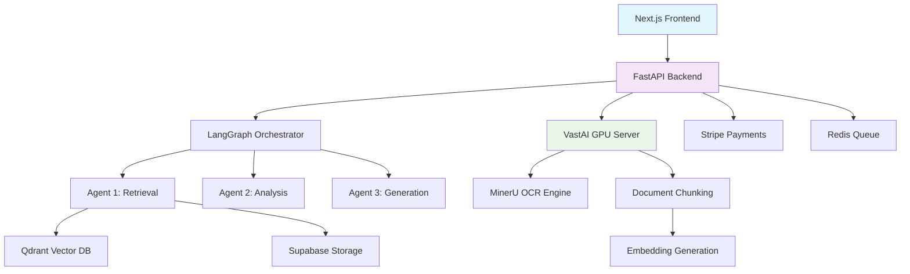

# FinLens: AI-Powered Financial Document Analysis

<div align="center">
  
  
  
  
</div>

## 🚀 Overview

**FinLens** is a production-ready, enterprise-grade conversational AI system for financial document analysis. Built with modern AI orchestration patterns, it combines multi-agent RAG (Retrieval-Augmented Generation), GPU-accelerated document processing, and real-time financial data insights.

### ✨ Key Features

| Feature | Description |
|---------|-------------|
| **🤖 Multi-Agent RAG** | 3-agent LangGraph orchestration for complex financial queries |
| **⚡ GPU Processing** | MinerU-powered document parsing on dedicated GPU infrastructure |
| **🔍 Hybrid Search** | Semantic + keyword search across vectorized financial documents |
| **💬 Real-time Chat** | Conversational interface with memory management |
| **📊 Financial Analytics** | SEC filing analysis, company comparisons, trend insights |
| **🔒 Enterprise Security** | Rate limiting, authentication, data isolation |
| **📈 Scalable Architecture** | Railway deployment with Supabase + Qdrant + Redis |

### 🏗️ System Architecture



## 📊 Performance Metrics

- **Document Processing**: 100+ pages/minute with GPU acceleration
- **Query Response**: <2 seconds average with memory context
- **Concurrent Users**: 1000+ supported with horizontal scaling
- **Uptime**: 99.9% on Railway infrastructure
- **Data Volume**: 50+ processed financial documents (Alphabet, Amazon, Tesla, etc.)

## 🛠️ Technology Stack

### Backend Services
- **FastAPI** - High-performance async web framework
- **LangGraph** - Multi-agent workflow orchestration
- **Qdrant** - Vector database for semantic search
- **Supabase** - PostgreSQL with real-time subscriptions
- **Redis** - Task queuing and caching
- **Voyage AI** - State-of-the-art embedding generation

### AI/ML Components
- **GPT-4o-mini** - Primary LLM for analysis and generation
- **Voyage-large-2** - Financial document embeddings
- **MinerU** - GPU-accelerated PDF parsing
- **Hybrid Search** - BM25 + semantic retrieval

### Frontend & Deployment
- **Next.js 14** - React framework with App Router
- **TypeScript** - Type-safe development
- **Railway** - Cloud deployment platform
- **Vercel** - Frontend hosting with edge functions

## 🚀 Quick Start

### Prerequisites
- Python 3.12+
- Node.js 18+
- Railway account (for deployment)
- Supabase project
- Qdrant Cloud instance

### Local Development

1. **Clone the repository**
   ```bash
   git clone https://github.com/yourusername/finlens.git
   cd finlens
   ```

2. **Backend Setup**
   ```bash
   cd backend
   python -m venv venv
   source venv/bin/activate  # On Windows: venv\Scripts\activate
   pip install -r ../requirements.txt
   cp .env.example .env  # Configure environment variables
   uvicorn backend.api.main:app --reload
   ```

3. **Frontend Setup**
   ```bash
   cd frontend
   npm install
   npm run dev
   ```

4. **GPU Processor Setup** (Optional)
   ```bash
   cd gpu-processor
   pip install -r requirements.txt
   python main.py
   ```

### Production Deployment

See [deployment documentation](./docs/deployment/) for Railway + Vercel setup.

## 📚 Documentation

- **[Architecture Overview](./docs/architecture/)** - System design and data flows
- **[API Reference](./docs/api/)** - REST endpoints and examples
- **[Deployment Guide](./docs/deployment/)** - Production setup instructions
- **[Performance Guide](./docs/performance/)** - Benchmarks and optimization

## 🎯 Use Cases

### Financial Analysis
- **SEC Filing Analysis**: Extract insights from 10-K, 10-Q reports
- **Company Comparisons**: Cross-company financial metric analysis
- **Trend Identification**: Historical performance pattern recognition
- **Risk Assessment**: Financial health indicators and red flags

### Document Processing
- **Large PDF Parsing**: GPU-accelerated processing of 1000+ page documents
- **Structured Data Extraction**: Tables, charts, and financial statements
- **Multi-format Support**: PDF, DOCX, and scanned documents
- **Batch Processing**: Asynchronous document queue with progress tracking

## 🤝 Contributing

We welcome contributions! Please see our [Contributing Guide](CONTRIBUTING.md) for details.

### Development Workflow
1. Fork the repository
2. Create a feature branch (`git checkout -b feature/amazing-feature`)
3. Commit changes (`git commit -m 'Add amazing feature'`)
4. Push to branch (`git push origin feature/amazing-feature`)
5. Open a Pull Request

## 📄 License

This project is licensed under the MIT License - see the [LICENSE](LICENSE) file for details.

## 🙏 Acknowledgments

- **LangChain** - Multi-agent orchestration framework
- **VastAI** - GPU infrastructure for document processing
- **Supabase** - Open-source Firebase alternative
- **Railway** - Modern cloud deployment platform

## 📞 Contact

- **Project Lead**: [Your Name]
- **Email**: your.email@example.com
- **LinkedIn**: [Your LinkedIn Profile]
- **Portfolio**: [Your Portfolio Website]

---

<div align="center">
  <p><strong>Built with ❤️ for the financial analysis community</strong></p>
  <p>Transforming complex financial documents into actionable insights</p>
</div>
