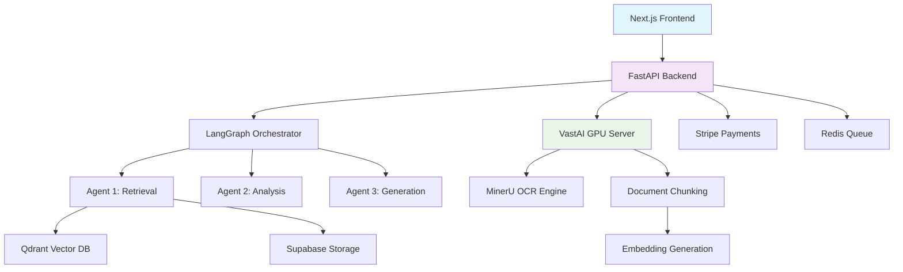

# FinLens: AI-Powered Financial Document Analysis

<div align="center">
  
  
  
  
  
</div>

**Portfolio Project** — Production-ready codebase demonstrating enterprise AI system architecture.

## 🚀 Overview

**FinLens** extracts actionable insights from unstructured financial documents. Analysts spend hours manually reviewing dense SEC filings, annual reports, and regulatory documents—often 1000+ pages of financial statements, risk disclosures, and regulatory language.

FinLens processes these documents through GPU-accelerated parsing and multi-agent AI analysis, delivering instant answers to natural language queries. What takes hours of careful reading and cross-referencing is accomplished in seconds.

## Project Status

FinLens is a portfolio project implementing production-grade AI infrastructure for financial document analysis. The system uses multi-agent orchestration, GPU-accelerated document processing, and scalable cloud services. Code quality and architecture patterns follow enterprise standards, suitable for production deployment.

### ✨ Key Features

| Feature                      | Description                                                     |
| ---------------------------- | --------------------------------------------------------------- |
| **🤖 Multi-Agent RAG**       | 3-agent LangGraph orchestration for complex financial queries   |
| **⚡ GPU Processing**        | MinerU-powered document parsing on dedicated GPU infrastructure |
| **🔍 Hybrid Search**         | Semantic + keyword search across vectorized financial documents |
| **💬 Real-time Chat**        | Conversational interface with memory management                 |
| **📊 Financial Analytics**   | SEC filing analysis, company comparisons, trend insights        |
| **🔒 Enterprise Security**   | Rate limiting, authentication, data isolation                   |
| **📈 Scalable Architecture** | Railway deployment with Supabase + Qdrant + Redis               |

### Complex Query Capabilities

The multi-agent system handles complex analytical queries through specialized workflow stages:

- **Query Decomposition**: Agent 1 breaks down multi-part questions into sub-queries, retrieves relevant context from conversation memory, and performs hybrid search across documents
- **Multi-Document Analysis**: Agent 2 analyzes retrieved chunks from multiple documents, extracts financial metrics, and performs cross-company comparisons
- **Synthesis & Validation**: Agent 3 generates structured responses with citations, creates data visualizations (Chart.js), and validates answer quality

**Supported Query Types:**

- Cross-company comparisons (e.g., "Compare Tesla's R&D spending vs Ford and GM")
- Multi-year trend analysis (e.g., "Show Microsoft's operating income for the last 5 years")
- Complex aggregations (e.g., "How has cloud revenue growth compared between Amazon, Microsoft, and Google over the past 3 years?")
- Risk factor extraction across document sections
- Financial statement data extraction with calculations

### 🏗️ System Architecture



## 📊 Performance Metrics

- **Document Processing**: GPU-accelerated parsing with MinerU OCR
- **Query Response**: 10-15 seconds average for complex multi-document queries
- **Retrieval**: Hybrid semantic + keyword search (TOP_K_INITIAL=30, TOP_K_FINAL=8)
- **Chunking**: Semantic boundaries with max 2000 characters per chunk
- **Embeddings**: 2048-dimensional vectors (Voyage AI voyage-large-2)
- **User Documents**: Each user uploads and queries their own document collection

## 🛠️ Technology Stack

### Backend Services

- **FastAPI** - High-performance async web framework
- **LangGraph** - Multi-agent workflow orchestration
- **Qdrant** - Vector database for semantic search
- **Supabase** - PostgreSQL with real-time subscriptions
- **Redis** - Task queuing and caching
- **Voyage AI** - State-of-the-art embedding generation

### AI/ML Components

- **GPT-4o/GPT-4o-mini** - Task-based model selection (GPT-4o for analysis/generation, GPT-4o-mini for query processing)
- **Voyage-large-2** - Financial document embeddings (2048 dimensions)
- **MinerU** - GPU-accelerated PDF OCR parsing
- **Hybrid Search** - Semantic + keyword retrieval with TOP_K_INITIAL=30, TOP_K_FINAL=8

### Frontend & Deployment

- **Next.js 14** - React framework with App Router
- **TypeScript** - Type-safe development
- **Railway** - Cloud deployment platform
- **Vercel** - Frontend hosting with edge functions

## 🚀 Quick Start

### Prerequisites

- Python 3.12+
- Node.js 18+
- Railway account (for deployment)
- Supabase project
- Qdrant Cloud instance

### Local Development

1. **Clone the repository**

   ```bash
   git clone https://github.com/StephaneWamba/finlens.git
   cd finlens
   ```

2. **Backend Setup**

   ```bash
   cd backend
   python -m venv venv
   source venv/bin/activate  # On Windows: venv\Scripts\activate
   pip install -r ../requirements.txt
   cp .env.example .env  # Configure environment variables
   uvicorn backend.api.main:app --reload
   ```

3. **Frontend Setup**

   ```bash
   cd frontend
   npm install
   npm run dev
   ```

4. **GPU Processor Setup** (Optional)
   ```bash
   cd gpu-processor
   pip install -r requirements.txt
   python main.py
   ```

### Production Deployment

See [deployment documentation](./docs/deployment.md) for Railway + Vercel setup.

## 📚 Documentation

- **[Architecture Overview](./docs/architecture.md)** - System design and data flows
- **[API Reference](./docs/api.md)** - REST endpoints and examples
- **[Deployment Guide](./docs/deployment.md)** - Production setup instructions

## 🎯 Use Cases

### Financial Analysis

- **SEC Filing Analysis**: Extract insights from 10-K, 10-Q reports
- **Company Comparisons**: Cross-company financial metric analysis
- **Trend Identification**: Historical performance pattern recognition
- **Risk Assessment**: Financial health indicators and red flags

### Document Processing

- **Large PDF Parsing**: GPU-accelerated processing of 1000+ page documents via MinerU OCR
- **Structured Data Extraction**: Tables, charts, and financial statements from parsed content
- **File Format Support**: PDF, PNG, JPG, JPEG (images processed via OCR)
- **Batch Processing**: Asynchronous document queue with parallel GPU processing
- **Semantic Chunking**: Intelligent chunking with page/heading boundaries (max 2000 chars)

## 🤝 Contributing

Contributions welcome. Open an issue or submit a pull request.

## 📄 License

This project is licensed under the MIT License - see the [LICENSE](LICENSE) file for details.

## 🙏 Acknowledgments

- **LangChain** - Multi-agent orchestration framework
- **VastAI** - GPU infrastructure for document processing
- **Supabase** - Open-source Firebase alternative
- **Railway** - Modern cloud deployment platform

## 📞 Contact

For questions or issues, open a [GitHub Issue](https://github.com/StephaneWamba/finlens/issues).

---
