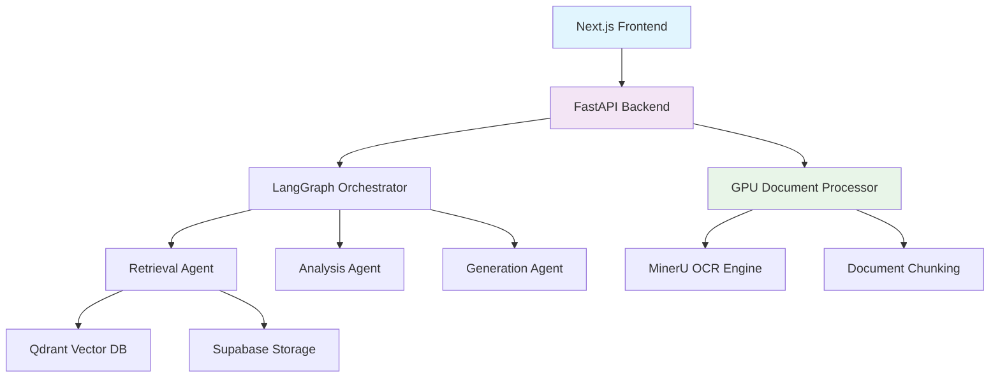

# Architecture Overview

Multi-agent RAG system for financial document analysis. GPU-accelerated parsing, vector search, and LangGraph orchestration.

## System Components

## Core Technologies

| Component            | Technology                | Purpose                                                       |
|----------------------|---------------------------|---------------------------------------------------------------|
| **Frontend**         | Next.js 14, TypeScript    | User interface and document management                        |
| **Backend**          | FastAPI, Python 3.12      | API services and business logic                               |
| **AI Orchestration** | LangGraph                 | Multi-agent workflow coordination                             |
| **Vector Database**  | Qdrant                    | Semantic search and document embeddings                       |
| **Document Storage** | Supabase                  | File storage and metadata                                     |
| **Embeddings**       | Voyage AI                 | Financial document vectorization (voyage-large-2, 2048 dims)  |
| **LLM**              | OpenAI GPT-4o/GPT-4o-mini | Analysis and response generation                              |
| **GPU Processing**   | VastAI + MinerU + CUDA    | Document parsing acceleration                                 |

## Data Flow

1. **Document Upload**: Files stored in Supabase Storage (user-specific)
2. **GPU Processing**: Documents sent to VastAI GPU server for MinerU OCR parsing
3. **Chunking**: Parsed content split into semantic chunks (max 2000 chars, page/heading boundaries)
4. **Embedding**: Chunks embedded with Voyage AI (voyage-large-2, 2048 dimensions)
5. **Vector Storage**: Embeddings stored in Qdrant with metadata (company, year, document_type, fiscal_quarter, user_id)
6. **Query Processing**: 3-agent LangGraph workflow (searches only user's documents)
   - Agent 1: Query decomposition, memory retrieval, hybrid search (TOP_K_INITIAL=30)
   - Agent 2: Analysis of retrieved chunks, metric extraction
   - Agent 3: Response generation with charts, quality validation (TOP_K_FINAL=8)
7. **Response Delivery**: Context-aware answers with source citations and Chart.js visualizations

## Complex Query Handling

**Query Decomposition (Agent 1):**
- Breaks down multi-part questions into sub-queries
- Retrieves context from conversation memory
- Hybrid search (semantic + keyword) with metadata filtering
- Retrieves TOP_K_INITIAL=30 chunks

**Multi-Document Analysis (Agent 2):**
- Analyzes retrieved chunks from multiple documents
- Extracts financial metrics, ratios, comparative data
- Cross-company and cross-year comparisons
- Validates data consistency

**Synthesis & Validation (Agent 3):**
- Generates structured responses with source citations
- Creates Chart.js visualizations for numerical data
- Validates answer quality
- Refines to TOP_K_FINAL=8 most relevant chunks

**Supported Query Types:**
- Cross-company financial comparisons
- Multi-year trend analysis
- Complex aggregations across documents
- Risk factor extraction
- Financial statement data extraction

## Security & Performance

- **Rate Limiting**: Subscription-based monthly query limits
- **Authentication**: JWT tokens with Supabase Auth
- **Data Isolation**: User-specific document access via Qdrant filters
- **Scalability**: Horizontal scaling with Railway auto-scaling
- **Monitoring**: Structured logging with async loggers
- **Chunking**: Semantic boundaries (page/heading breaks, max 2000 chars)
- **Retrieval**: Hybrid search with TOP_K_INITIAL=30, TOP_K_FINAL=8

## Deployment Architecture

- **Backend**: Railway (Docker-based auto-scaling)
- **Frontend**: Vercel (global CDN distribution)
- **Database**: Supabase (PostgreSQL with real-time subscriptions)
- **Vector DB**: Qdrant Cloud (managed vector storage)
- **GPU Processing**: VastAI (on-demand GPU instances)

Architecture supports processing 1000+ page documents with query response times averaging 10-15 seconds for complex multi-document queries.
