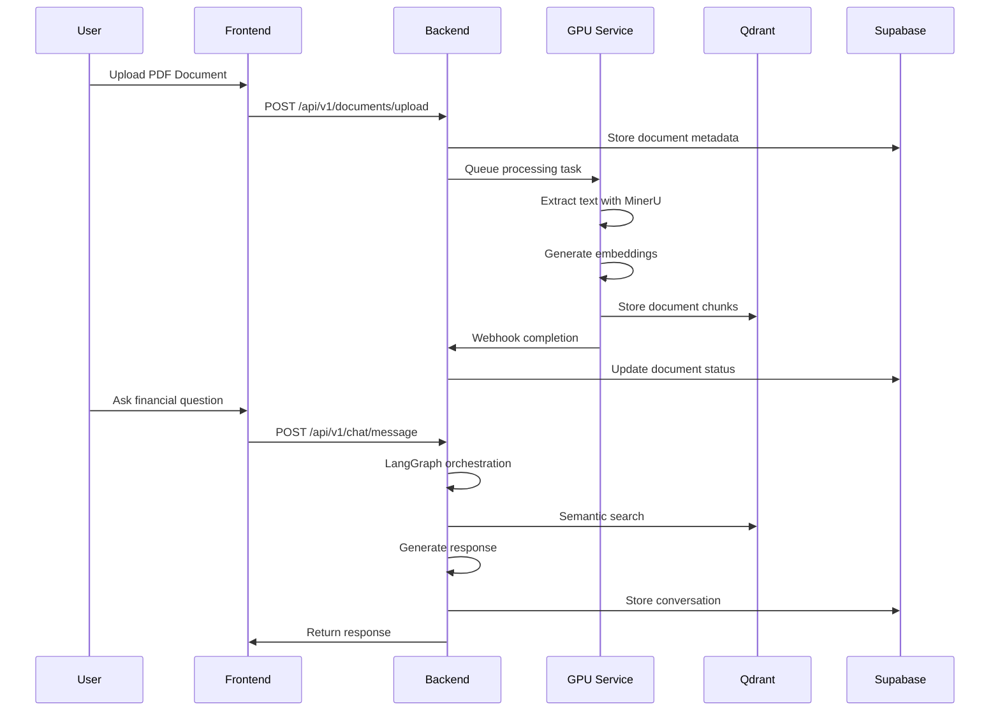

# System Architecture Overview

## Core Components

### 1. Frontend Layer (Next.js)
- **Technology**: Next.js 14 with App Router
- **Purpose**: User interface for document upload, chat, and analytics
- **Key Features**:
  - Real-time chat with WebSocket connections
  - PDF viewer with text selection
  - Document management dashboard
  - Responsive design with Tailwind CSS

### 2. Backend API (FastAPI)
- **Technology**: FastAPI with async/await patterns
- **Purpose**: Business logic and API orchestration
- **Key Features**:
  - RESTful API design
  - Rate limiting and authentication
  - Payment processing integration
  - Background task management

### 3. AI Orchestration (LangGraph)
- **Technology**: LangGraph multi-agent framework
- **Purpose**: Coordinate complex financial analysis workflows
- **Agents**:
  - **Agent 1**: Query understanding and document retrieval
  - **Agent 2**: Content analysis and validation
  - **Agent 3**: Response generation and formatting

### 4. Document Processing (GPU Service)
- **Technology**: MinerU with vLLM acceleration
- **Purpose**: Extract structured data from financial documents
- **Capabilities**:
  - PDF text extraction and table recognition
  - OCR for scanned documents
  - Chunking and embedding generation
  - Asynchronous processing queue

### 5. Vector Database (Qdrant)
- **Technology**: Qdrant Cloud with payload indexing
- **Purpose**: Store and search document embeddings
- **Features**:
  - Hybrid search (semantic + keyword)
  - Metadata filtering
  - Real-time updates
  - Horizontal scaling

### 6. Data Storage (Supabase)
- **Technology**: PostgreSQL with real-time subscriptions
- **Purpose**: User data, conversations, and document metadata
- **Features**:
  - Row Level Security (RLS)
  - Real-time chat updates
  - File storage integration
  - Authentication and user management

## Data Flow Architecture

## Security Architecture

### Authentication & Authorization
- JWT-based authentication with refresh tokens
- Role-based access control (RBAC)
- API key authentication for service-to-service calls

### Data Isolation
- User-scoped data access
- Supabase RLS policies
- Qdrant collection isolation per user

### Network Security
- HTTPS everywhere
- CORS configuration
- Rate limiting per user/IP
- Input validation and sanitization

## Scalability Design

### Horizontal Scaling
- Stateless backend services
- Database connection pooling
- Redis for session management
- Load balancer distribution

### Performance Optimization
- Async/await patterns throughout
- Caching layers (Redis + in-memory)
- Database indexing and query optimization
- CDN for static assets

### Monitoring & Observability
- Structured logging with correlation IDs
- Performance metrics collection
- Error tracking and alerting
- Health check endpoints
