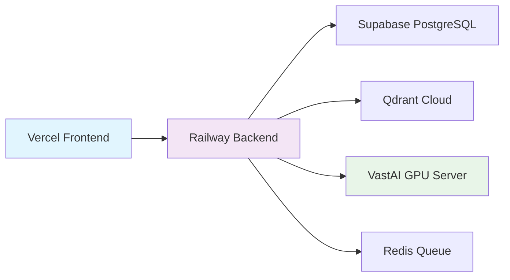

# Deployment Guide

Production deployment setup for FinLens on Railway (backend) and Vercel (frontend).

## Architecture Overview



## Prerequisites

| Service          | Purpose                 | Required |
| ---------------- | ----------------------- | -------- |
| **Railway**      | Backend hosting         | Yes      |
| **Vercel**       | Frontend hosting        | Yes      |
| **Supabase**     | PostgreSQL database     | Yes      |
| **Qdrant Cloud** | Vector database         | Yes      |
| **VastAI**       | GPU document processing | Yes      |
| **Redis**        | Task queue (optional)   | No       |
| **Stripe**       | Payments (optional)     | No       |

## Backend Deployment (Railway)

### 1. Create Railway Project

```bash
# Install Railway CLI
npm i -g @railway/cli

# Login
railway login

# Initialize project
railway init
```

### 2. Configure Environment Variables

Set these in Railway dashboard or via CLI:

```bash
# Core Settings
ENVIRONMENT=production
CORS_ORIGINS=https://your-frontend.vercel.app

# Database
SUPABASE_URL=https://your-project.supabase.co
SUPABASE_KEY=your-anon-key
SUPABASE_SECRET_KEY=your-service-role-key

# Vector Database
QDRANT_URL=https://your-cluster.qdrant.io
QDRANT_API_KEY=your-qdrant-api-key

# AI Services
OPENAI_API_KEY=sk-...
VOYAGE_API_KEY=pa-...
VOYAGE_EMBEDDING_MODEL=voyage-large-2
EMBEDDING_DIMENSIONS=2048

# GPU Processing
VAST_AI_SERVER_URL=http://your-gpu-server:8080
VAST_AI_API_KEY=your-vast-ai-key

# Optional: Redis
REDIS_URL=redis://your-redis:6379

# Optional: Stripe
STRIPE_SECRET_KEY=sk_live_...
STRIPE_PUBLISHABLE_KEY=pk_live_...
```

### 3. Deploy

Railway auto-detects Python and uses `railway.json` configuration:

```json
{
  "build": {
    "builder": "NIXPACKS"
  },
  "deploy": {
    "startCommand": "python -m backend.api.main",
    "healthcheckPath": "/health",
    "healthcheckTimeout": 300
  }
}
```

Deploy via:

```bash
railway up
```

Or connect GitHub repo for automatic deployments.

### 4. Verify Deployment

```bash
curl https://your-railway-url.up.railway.app/health
```

Expected response:

```json
{
  "status": "healthy",
  "version": "1.0.0",
  "database": "connected"
}
```

## Frontend Deployment (Vercel)

### 1. Connect Repository

1. Go to [Vercel Dashboard](https://vercel.com)
2. Import GitHub repository
3. Select `frontend` as root directory

### 2. Configure Environment Variables

```bash
NEXT_PUBLIC_API_URL=https://your-railway-url.up.railway.app
NEXT_PUBLIC_SUPABASE_URL=https://your-project.supabase.co
NEXT_PUBLIC_SUPABASE_ANON_KEY=your-anon-key
```

### 3. Configure Rewrites

Vercel uses `vercel.json` for API proxying:

```json
{
  "rewrites": [
    {
      "source": "/api/:path*",
      "destination": "https://finlens-backend-production.up.railway.app/v1/:path*"
    }
  ]
}
```

Replace with your actual Railway backend URL.

### 4. Deploy

Vercel auto-deploys on push to main branch.

## Database Setup (Supabase)

### 1. Run Migrations

```bash
# Install Supabase CLI
npm install -g supabase

# Link project
supabase link --project-ref your-project-ref

# Run migrations
supabase db push
```

Migrations are in `supabase/migrations/` directory.

### 2. Configure Row Level Security

Enable RLS policies for user data isolation:

```sql
-- Example: Users can only access their own documents
ALTER TABLE user_documents ENABLE ROW LEVEL SECURITY;

CREATE POLICY "Users can view own documents"
ON user_documents FOR SELECT
USING (auth.uid() = user_id);
```

## Vector Database Setup (Qdrant)

### 1. Create Cloud Cluster

1. Sign up at [Qdrant Cloud](https://cloud.qdrant.io)
2. Create cluster (recommended: 1GB RAM minimum)
3. Note cluster URL and API key

### 2. Initialize Collections

Collections are auto-created on first use, but you can verify:

```python
from qdrant_client import QdrantClient

client = QdrantClient(
    url="https://your-cluster.qdrant.io",
    api_key="your-api-key"
)

# Check collections
collections = client.get_collections()
print(collections)
```

Required collections:

- `document_chunks` (2048 dimensions)
- `conversation_memory` (2048 dimensions)

## GPU Server Setup (VastAI)

See [VastAI Server Setup](../VAST_AI_SERVER_SETUP.md) for detailed GPU server configuration.

Quick setup:

1. Deploy MinerU server on VastAI instance
2. Configure environment variables
3. Update `VAST_AI_SERVER_URL` in Railway

## Monitoring & Health Checks

### Health Endpoints

- `GET /health` - Basic health check
- `GET /health/ready` - Readiness probe (checks database connections)

### Railway Monitoring

Railway provides:

- Real-time logs
- Metrics dashboard
- Automatic restarts on failure

### Error Tracking

Configure logging in `backend/config/logging.py`:

- Structured JSON logs for production
- Error aggregation
- Performance metrics

## Scaling Considerations

| Component          | Scaling Strategy                                      |
| ------------------ | ----------------------------------------------------- |
| **Backend**        | Railway auto-scales based on traffic                  |
| **Frontend**       | Vercel edge network (global CDN)                      |
| **Database**       | Supabase auto-scaling (upgrade plan for high traffic) |
| **Vector DB**      | Qdrant Cloud scaling (upgrade cluster size)           |
| **GPU Processing** | Multiple VastAI instances with load balancing         |

## Cost Estimation

| Service      | Tier      | Monthly Cost (approx) |
| ------------ | --------- | --------------------- |
| Railway      | Hobby     | $5-20                 |
| Vercel       | Pro       | $20                   |
| Supabase     | Pro       | $25                   |
| Qdrant Cloud | Starter   | $25                   |
| VastAI       | On-demand | $0.50-2/hour          |
| **Total**    |           | **$75-100/month**     |

## Troubleshooting

### Backend Not Starting

Check Railway logs:

```bash
railway logs
```

Common issues:

- Missing environment variables
- Database connection failures
- Port binding errors

### Frontend API Errors

Verify API rewrites in `vercel.json`:

```bash
curl https://your-frontend.vercel.app/api/health
```

### Document Processing Fails

Check GPU server connectivity:

```bash
curl http://your-gpu-server:8080/health
```

Verify `VAST_AI_SERVER_URL` and `VAST_AI_API_KEY` in Railway.

## Security Checklist

- [ ] All API keys stored as environment variables
- [ ] CORS configured for specific origins
- [ ] Rate limiting enabled
- [ ] Row Level Security enabled in Supabase
- [ ] HTTPS enforced (automatic on Railway/Vercel)
- [ ] API authentication required for all endpoints
- [ ] User data isolation verified

## Support

For deployment issues:

- [GitHub Issues](https://github.com/StephaneWamba/finlens/issues)
- Railway support: [docs.railway.app](https://docs.railway.app)
- Vercel support: [vercel.com/docs](https://vercel.com/docs)
