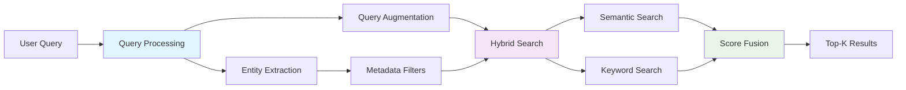

# Hybrid Search Implementation

Hybrid retrieval combining semantic vector search and keyword-based BM25 search.

## Retrieval Pipeline



## Query Processing

### Entity Extraction

LLM extracts entities from user query:

| Entity           | Type            | Example                               |
| ---------------- | --------------- | ------------------------------------- |
| `companies`      | List[str]       | `["apple", "microsoft"]`              |
| `year`           | int             | `2023`                                |
| `year_range`     | Tuple[int, int] | `(2020, 2024)`                        |
| `document_type`  | str             | `"10-K"`, `"10-Q"`                    |
| `fiscal_quarter` | int             | `1`, `2`, `3`, `4`                    |
| `sector`         | str             | `"Technology"`                        |
| `chunk_type`     | str             | `"table"`, `"paragraph"`, `"heading"` |

### Query Augmentation

LLM generates keyword-only query (no stopwords):

- Input: `"What was Apple's revenue in 2023?"`
- Output: `"apple revenue 2023 total net sales earnings financial fiscal table breakdown"`

Augmentation adds:

- Financial terminology synonyms (revenue → revenue, net revenue, sales, earnings)
- Domain-specific keywords (fiscal, financial, table)
- Removes stopwords (what, was, in, the)

## Metadata Filtering

Qdrant payload filters applied before search:

| Filter Field     | Type | Index Type      |
| ---------------- | ---- | --------------- |
| `user_id`        | uuid | uuid (required) |
| `document_id`    | uuid | uuid            |
| `company`        | str  | keyword         |
| `fiscal_year`    | int  | integer         |
| `document_type`  | str  | keyword         |
| `fiscal_quarter` | int  | integer         |
| `chunk_type`     | str  | keyword         |
| `has_table`      | bool | -               |

Filters built as Qdrant `Filter` objects with `FieldCondition` and `MatchValue`/`Range`.

## Hybrid Search

### Semantic Search

- **Embedding**: Query embedded using Voyage AI `voyage-large-2` (2048 dimensions)
- **Vector Search**: Cosine similarity search in Qdrant
- **Collection**: `document_chunks` (single collection for all users, filtered by `user_id`)
- **Top-K**: TOP_K_INITIAL=30 (initial retrieval)

### Keyword Search

- **Algorithm**: BM25 (Best Matching 25)
- **Implementation**: Custom `KeywordSearcher` class
- **Index**: In-memory inverted index built from chunk content
- **Scoring**: BM25 relevance score

### Score Fusion

Scores combined using weighted average:

```
final_score = (semantic_score * semantic_weight) + (keyword_score * keyword_weight)
```

Default weights:

- Semantic: 0.7
- Keyword: 0.3

Results sorted by `final_score` and top-K selected.

## Retrieval Refinement

Agent 1 uses iterative refinement:

1. **Initial Retrieval**: TOP_K_INITIAL=30 chunks
2. **Validation**: LLM checks if chunks answer query
3. **Refinement**: If insufficient, query refined with additional keywords
4. **Re-retrieval**: Search repeated with refined query
5. **Max Attempts**: 3 retrieval attempts

Final results: TOP_K_FINAL=8 chunks passed to Agent 2.

## Multi-Company Balancing

For comparative queries (multiple companies), results balanced across companies:

- Ensures representation from each company
- Prevents single company dominating results
- Applied when `companies` filter has multiple values

## Implementation

### Retriever Class

Location: `backend/core/ai/retrieval/retriever.py`

```python
class Retriever:
    def retrieve(
        self,
        query: str,
        user_id: str,
        top_k: int = None,
        use_hybrid: bool = True,
        expand_query: bool = True,
        # ... metadata filters
    ) -> List[Dict[str, Any]]
```

### QdrantClient

Location: `backend/core/ai/vector_db/qdrant_client.py`

```python
class QdrantClient:
    def search(
        self,
        query_vector: List[float],
        user_id: str,
        top_k: int = 10,
        # ... metadata filters
    ) -> List[Dict[str, Any]]
```

### Query Processor

Location: `backend/core/ai/retrieval/query_processor.py`

- Uses LLM for entity extraction and query augmentation
- Returns `ProcessedQuery` with entities and augmented keywords

## Performance

- **Initial Retrieval**: TOP_K_INITIAL=30 chunks
- **Final Retrieval**: TOP_K_FINAL=8 chunks (after refinement)
- **Max Attempts**: 3 retrieval loops
- **Response Time**: ~2-4 seconds for hybrid search (excluding LLM processing)
