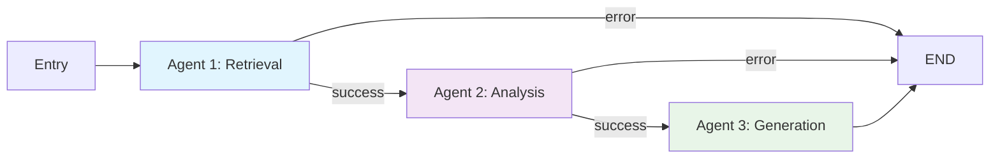
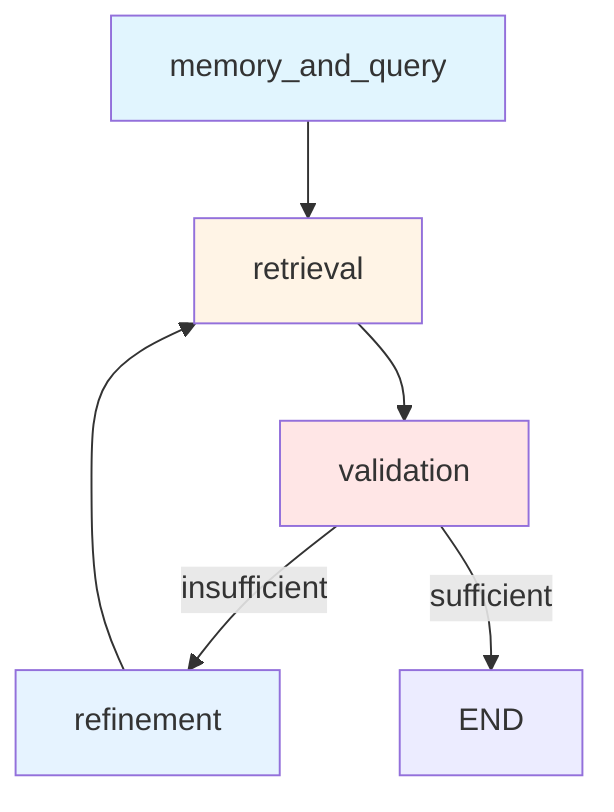
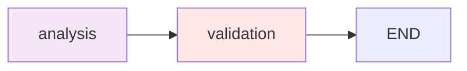
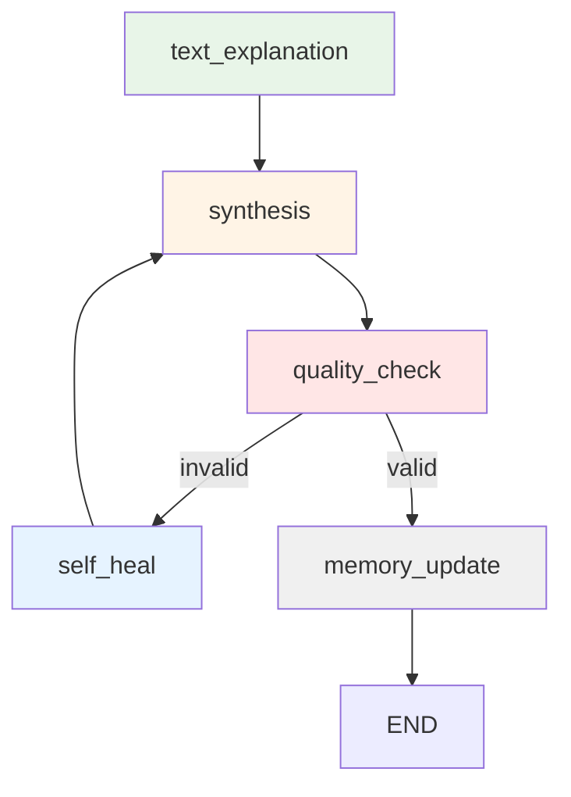

# LangGraph Workflow

Multi-agent workflow orchestration using LangGraph state machine for query processing.

## Main Graph Structure



## AgentState Schema

State structure passed between agents:

| Field                  | Type                 | Description                             |
| ---------------------- | -------------------- | --------------------------------------- |
| `current_query`        | str                  | User's query text                       |
| `user_id`              | str                  | User UUID (required for data isolation) |
| `session_id`           | str                  | Conversation session UUID               |
| `messages`             | List[dict]           | Conversation history                    |
| `processed_query`      | ProcessedQuery       | Extracted entities and augmented query  |
| `retrieved_context`    | List[RetrievedChunk] | Retrieved document chunks               |
| `analysis_results`     | AnalysisResult       | Agent 2 analysis output                 |
| `response`             | AnswerResponse       | Final answer with citations             |
| `retrieval_attempts`   | int                  | Max 3 attempts for retrieval refinement |
| `self_heal_attempts`   | int                  | Max 2 attempts for response healing     |
| `retrieval_sufficient` | bool                 | Whether retrieved context is sufficient |
| `response_valid`       | bool                 | Whether response passed quality check   |
| `error`                | str                  | Error message if workflow fails         |

## Agent 1: Retrieval Subgraph

Iterative retrieval with validation loop.



### Nodes

1. **memory_and_query**: Parallel execution

   - Memory check: Retrieves relevant conversation history
   - Query processing: Extracts entities, augments query with keywords

2. **retrieval**: Hybrid search

   - Semantic search (Qdrant vector similarity)
   - Keyword search (BM25)
   - Metadata filtering (company, year, document_type, etc.)
   - Returns TOP_K_INITIAL=30 chunks

3. **validation**: LLM validates retrieved context

   - Checks if chunks answer the query
   - Identifies gaps in information
   - Sets `retrieval_sufficient` flag

4. **refinement**: Query refinement if insufficient
   - Adds keywords based on identified gaps
   - Updates `retrieval_attempts` counter
   - Loops back to retrieval (max 3 attempts)

## Agent 2: Analysis Subgraph

Linear flow for chunk analysis.



### Nodes

1. **analysis**: Extracts financial metrics from retrieved chunks

   - Identifies primary metric (revenue, income, etc.)
   - Performs calculations (growth rates, comparisons)
   - Generates natural language analysis

2. **validation**: Validates analysis quality
   - Checks for errors in calculations
   - Validates metric extraction accuracy
   - Sets validation flags

## Agent 3: Generation Subgraph

Response generation with quality loop.



### Nodes

1. **text_explanation**: Generates text explanation

   - Uses analysis results from Agent 2
   - Formats response in Markdown
   - Includes LaTeX for formulas

2. **synthesis**: Creates final answer

   - Combines text explanation with charts
   - Extracts source citations from chunks
   - Formats Chart.js configurations

3. **quality_check**: Validates response quality

   - Checks chart JSON validity
   - Validates source citations
   - Sets `response_valid` flag

4. **self_heal**: Fixes invalid responses

   - Regenerates response based on errors
   - Updates `self_heal_attempts` counter
   - Loops back to synthesis (max 2 attempts)

5. **memory_update**: Stores conversation in memory
   - Updates Qdrant conversation_memory collection
   - Compresses long conversations
   - Runs in background (non-blocking)

## Configuration

Workflow execution config:

```python
config = {
    "configurable": {
        "thread_id": session_id  # LangGraph thread for state persistence
    },
    "recursion_limit": 15  # Prevents infinite loops
}
```

## Error Handling

- Errors set `state["error"]` field
- Conditional edges check for errors and route to END
- No retry logic at workflow level (handled within agents)

## State Transitions

| From            | To            | Condition                                                 |
| --------------- | ------------- | --------------------------------------------------------- |
| Agent 1         | Agent 2       | No error in state                                         |
| Agent 1         | END           | Error in state                                            |
| Agent 2         | Agent 3       | No error in state                                         |
| Agent 2         | END           | Error in state                                            |
| Agent 3         | END           | Always (after memory_update)                              |
| validation (A1) | refinement    | `retrieval_sufficient=False` AND `retrieval_attempts < 3` |
| validation (A1) | END           | `retrieval_sufficient=True` OR `retrieval_attempts >= 3`  |
| quality_check   | self_heal     | `response_valid=False` AND `self_heal_attempts < 2`       |
| quality_check   | memory_update | `response_valid=True` OR `self_heal_attempts >= 2`        |
